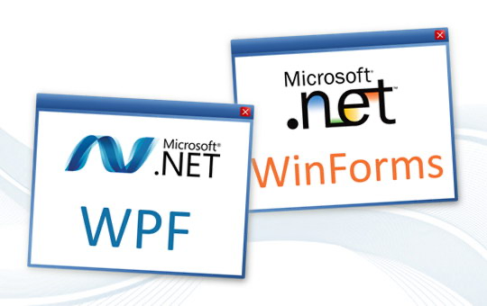

# {{ page.title }}

⏱️ Durée estimée : {{ page.duration }}

> {{ page.description }} 

## 🎯 Objectifs pédagogiques

- **Comprendre** les concepts fondamentaux d'Electron, .NET et Java.  
- **Identifier** les forces et faiblesses de chaque framework pour le développement desktop.  
- **Analyser** les cas d'utilisation typiques de ces technologies.

---

> Les frameworks modernes comme **Electron**, **.NET**, et **Java** permettent de développer des applications desktop performantes et adaptées à divers environnements et besoins. Ce module explore leurs spécificités et leurs applications.  

---

## Electron

Framework JavaScript basé sur Node.js et Chromium. Idéal pour créer des applications cross-platform avec des technologies web (HTML, CSS, JS). 

> Applications web empaquetées comme applications desktop (ex. : Slack, VS Code).

---

**Avantages** :  
- Développement rapide avec des technologies web.  
- Cross-platform : un seul code pour Windows, macOS, et Linux.  
- Large communauté et nombreux plugins.  

**Inconvénients** :  
- Consommation élevée de ressources (mémoire et CPU).  
- Taille importante des binaires (Chromium intégré).  

**Cas d'utilisation typiques** :  
- **Slack** : Communication et collaboration.  
- **Visual Studio Code** : IDE multiplateforme.  
- **Figma** : Outil de design collaboratif.  

---

## .NET

Écosystème Microsoft pour créer des applications natives Windows performantes avec WPF et WinForms, intégrées à l'OS (ex. : Office).

> .NET est conçu pour exploiter au mieux les capacités des machines Windows et s'intègre parfaitement dans l'écosystème Microsoft.

---

**Avantages** :  
- Performance native sur Windows.  
- Support des frameworks WPF et WinForms.  
- Intégration poussée avec les services et outils Microsoft.  

**Inconvénients** :  
- Principalement ciblé sur Windows (malgré le support cross-platform avec .NET Core).  
- Courbe d'apprentissage pour les nouveaux développeurs.  

**Cas d'utilisation typiques** :  
- **Microsoft Office** : Suite bureautique.  
- **Logiciels ERP** : Gestion des processus métier.  
- **Applications internes d'entreprise** : Intégration Windows avancée.  

---

## Java

Technologie mature et cross-platform avec JavaFX et Swing pour créer des applications modernes.

> Applications robustes et multiplateformes avec des interfaces riches (ex. : IntelliJ IDEA).

---

**Avantages** :  
- Multiplateforme grâce à la JVM (Java Virtual Machine).  
- API riches pour les interfaces utilisateur (JavaFX, Swing).  
- Grande stabilité et rétrocompatibilité.  

**Inconvénients** :  
- Nécessité d'installer la JVM pour exécuter les applications.  
- Interfaces parfois perçues comme moins modernes sans personnalisation.  

**Cas d'utilisation typiques** :  
- **IntelliJ IDEA** : IDE pour développeurs.  
- **NetBeans** : Environnement de développement.  
- **Logiciels éducatifs** : Simulations ou calculs complexes.  

---

## Comparaison des frameworks  

| **Critère**      | **Electron**      | **.NET**           | **Java**           |
|------------------|-------------------|--------------------|--------------------|
| **Portabilité**  | Très élevée       | Moyenne  | Élevée             |
| **Performance**  | Moyenne (Chromium) | Élevée        | Élevée             |
| **Complexité**   | Faible  | Modérée   | Modérée            |
| **Communauté**   | Large (JS)| Large         | Mature |

---

## Études de cas pratiques  

- **Slack (Electron)** : Application multiplateforme pour la collaboration d'équipe.  
- **Power BI (Microsoft .NET)** : Outil d'analyse de données performant pour Windows.  
- **IntelliJ IDEA (Java)** : IDE robuste et multiplateforme pour les développeurs.  

---

## Conclusion  

**Le choix du framework dépend** :

1. Des besoins en performances.  
2. De l'intégration au système d'exploitation.  
3. Des compétences des équipes.  

---

🌟 **Astuce** : Choisissez le bon outil en fonction de vos priorités (portabilité, performance, simplicité).  
